# 🛡️ Awesome AI Security Posture Management (AI-SPM) 🚀

        

> **A curated directory of top Enterprise SaaS platforms and Open-Source tools for AI Security Posture Management (AI-SPM), LLM Security, AI Red Teaming, Guardrails, Model Serialization Scanning, and MLOps Security.** 

---

## 📌 Table of Contents

- [🌐 Overview & Market Landscape](#-overview--market-landscape)
- [🏢 Top Enterprise SaaS Platforms](#-top-enterprise-saas-platforms)
- [🔓 Top Open-Source GitHub Projects](#-top-open-source-github-projects)
- [🎯 Frameworks & Standards](#-frameworks--standards)
- [🤝 How to Contribute](#-how-to-contribute)
- [💖 Support & Sponsorship](#-support--sponsorship)
- [⚖️ Disclaimer](#%EF%B8%8F-disclaimer)
- [📈 Star History](#-star-history)

---

## 🌐 Overview & Market Landscape

**AI Security Posture Management (AI-SPM)** extends traditional Cloud Security Posture Management (CSPM) to enterprise Machine Learning and Generative AI ecosystems. AI-SPM platforms continuously discover AI/ML assets (foundation models, LLMs, AI agents, training pipelines, embeddings, and vector databases), evaluate configurations against industry frameworks (such as **OWASP LLM Top 10**, **NIST AI RMF**, and **MITRE ATLAS**), scan model artifacts for supply-chain vulnerabilities, and enforce real-time security guardrails.

---

## 🏢 Top Enterprise SaaS Platforms

> 💡 **Market Size & Industry Landscape**: The global **AI Security Posture Management (AI-SPM)** and AI Security market is estimated at **$1.8 Billion in 2025** and is projected to reach **$12.5 Billion+ by 2030** (CAGR ~45%). The sector is **moderately fragmented and rapidly consolidating**, as cybersecurity giants (such as Palo Alto Networks, Cisco, Check Point, F5, and Tenable) actively acquire category leaders to build unified, end-to-end enterprise security platforms.

The table below lists leading commercial SaaS and enterprise solutions, sorted by **Company Size / Valuation / Market Cap** (descending):

| 🏢 Product / Platform | 📝 Description | 📊 Company Size / Valuation / Revenue | 💵 Pricing | 🎁 Free Tier / Trial Limit |
| :--- | :--- | :--- | :--- | :--- |
| **[NVIDIA AI Security / NGC](https://www.nvidia.com/)** | Enterprise AI stack with security tooling, guardrails, & model governance for production LLM pipelines. | **~$3.2 Trillion** Market Cap (Public: NYSE `NVDA`) / ~$120B Rev | **$4,500 / GPU / year** (NVIDIA AI Enterprise) | **1,000 free API test credits** on NVIDIA NGC Catalog |
| **[Protect AI](https://protectai.com/)** | Comprehensive MLSecOps platform covering model scanning, supply chain risk, & MLOps security posture. | **~$700 Million** (Acquired by Palo Alto Networks; $100M+ raised) | Enterprise licensing starting **~$25,000 / year** | **14-day enterprise trial** (plus free open-source ModelScan) |
| **[Robust Intelligence](https://www.robustintelligence.com/)** | AI risk management, automated model stress testing, vulnerability assessment, & continuous audit. | **~$400 Million** (Acquired by Cisco; $44M raised) | Enterprise subscription starting **~$30,000 / year** | **30-day proof-of-concept (POC)** sandbox environment |
| **[HiddenLayer](https://www.hiddenlayer.com/)** | AI discovery, model integrity scanning, adversarial threat defense, & runtime protection. | **~$383 Million** Valuation ($156M Total Raised; $100M Series B) | Tiered enterprise quotes starting **~$20,000 / year** | **14-day AWS / Azure marketplace** proof-of-concept trial |
| **[Lakera AI](https://www.lakera.ai/)** | Real-time LLM application security, prompt injection defense, & safety posture guardrails. | **~$300 Million** (Acquired by Check Point; $20M Series A) | Community free; Paid tiers starting **~$500 / month** | **Free Forever Community Plan** with **10,000 requests / month** |
| **[CalypsoAI](https://calypsoai.com/)** | Enterprise AI red teaming, prompt scanning, model vulnerability testing, & policy enforcement. | **~$180 Million** (Acquired by F5; $43.2M total funding) | Enterprise licensing starting **~$15,000 / year** via F5 | **14-day enterprise evaluation trial** upon sales request |
| **[Apex Security](https://www.tenable.com/)** | GenAI data loss prevention (DLP), shadow AI discovery, access control, & posture management. | **~$105 Million** (Acquired by Tenable; $7M Seed by Sequoia) | Enterprise licensing starting **~$12,000 / year** via Tenable | **14-day enterprise POC trial** via sales demo |
| **[Fiddler AI](https://www.fiddler.ai/)** | Enterprise AI observability, continuous evaluation, drift monitoring, & real-time guardrails. | **~$100 Million** Valuation ($100M Total Raised; $30M Series C) | **$0.002 per trace** on Developer plan (or custom annual) | **Free Guardrails Tier** + **30-day AWS SageMaker trial** (5 models) |
| **[Patronus AI](https://www.patronus.ai/)** | Automated LLM evaluation, copyright/PII detection, hallucination scoring, & adversarial testing. | **~$100 Million** Valuation ($70M Total Raised; $50M Series B) | Developer plan starts at **$25 / month** ($10/1k API calls) | **Free Developer Tier**: 2 projects, 5 experiments/proj, **$10 credits** |
| **[Aporia](https://www.aporia.com/)** | Real-time AI guardrails, model monitoring, hallucination prevention, & automated risk mitigation. | **~$50 Million** (Acquired by Coralogix; $30M raised) | Coralogix integrated plans starting **~$15 / month** | **14-day full-featured platform trial** on signup |

---

## 🔓 Top Open-Source GitHub Projects

Open-source tools provide vital building blocks for **model serialization scanning**, **LLM vulnerability probing**, **runtime guardrails**, **adversarial red teaming**, and **continuous evaluation** in CI/CD pipelines.

The table below lists top open-source projects, sorted by **GitHub Stars_Count** (descending):

| 📦 Repository & Link | ⭐ Stars_Badge | 📝 Key Capabilities & Focus |
| :--- | :---: | :--- |
| **[promptfoo](https://github.com/promptfoo/promptfoo)** |  | Continuous LLM evaluation, security testing, prompt injection scanning, & CI/CD regression testing. |
| **[garak](https://github.com/NVIDIA/garak)** |  | Open LLM vulnerability scanner & red-teaming framework by NVIDIA for detecting jailbreaks & hallucination failures. |
| **[Guardrails AI](https://github.com/guardrails-ai/guardrails)** |  | Open framework for adding structure, type verification, & safety validation guardrails to LLM outputs. |
| **[NeMo Guardrails](https://github.com/NVIDIA/NeMo-Guardrails)** |  | Open-source toolkit by NVIDIA for guiding LLM conversational flows & enforcing safety policy guardrails. |
| **[Giskard](https://github.com/giskard-ai/giskard)** |  | Open-source evaluation & testing framework for detecting bias, performance drift, & security flaws in AI models. |
| **[PyRIT](https://github.com/microsoft/PyRIT)** |  | Python Risk Identification Tool for Generative AI by Microsoft to automate red teaming & risk assessment. |
| **[Purple Llama](https://github.com/meta-llama/PurpleLlama)** |  | Meta's suite of open security evaluation tools & safety models (Llama Guard, CyberSecEval, Code Shield). |
| **[Deepchecks](https://github.com/deepchecks/deepchecks)** |  | Comprehensive open-source package for continuous validation, testing, & posture monitoring of ML/LLM models. |
| **[TruLens](https://github.com/truera/trulens)** |  | Evaluation & instrumentation library for measuring feedback metrics, latency, cost, & security of LLM apps. |
| **[LLM Guard](https://github.com/protectai/llm-guard)** |  | Comprehensive toolkit by Protect AI for sanitizing, evaluating, & securing LLM inputs & outputs in real-time. |
| **[AI Exploits](https://github.com/protectai/ai-exploits)** |  | Curated collection of real-world AI/ML vulnerabilities & exploits for security testing & research. |
| **[Rebuff](https://github.com/protectai/rebuff)** |  | Multi-layered prompt injection detection & defense framework for protecting LLM applications. |
| **[OWASP LLM Top 10](https://github.com/OWASP/www-project-top-10-for-large-language-model-applications)** |  | Official OWASP reference guide detailing the top 10 security vulnerabilities in LLM applications. |
| **[Counterfit](https://github.com/Azure/counterfit)** |  | Command-line automation framework by Microsoft Azure for assessing security posture of ML models. |
| **[ModelScan](https://github.com/protectai/modelscan)** |  | Open scanner for detecting unsafe code in serialized model files (Pickle, PyTorch, H5, Keras, SavedModel). |
| **[AI Scanner App](https://github.com/0din-ai/ai-scanner)** |  | Open web interface wrapping garak probes for scheduled model security assessments & risk scoring. |
| **[Vigil LLM](https://github.com/deadbits/vigil-llm)** |  | Micro-service for detecting prompt injection, jailbreaks, toxicity, & vector database risk in LLM pipelines. |
| **[AWS Sample AI-SPM](https://github.com/aws-samples/sample-ai-security-posture-management)** |  | Reference implementation of AI Security Posture Management patterns on AWS Cloud infrastructure. |

---

## 🎯 Frameworks & Standards

- **[OWASP Top 10 for LLM Applications](https://owasp.org/www-project-top-10-for-large-language-model-applications/)** — Standard awareness document for developers and web application security teams on critical LLM risks.
- **[NIST AI Risk Management Framework (AI RMF)](https://www.nist.gov/itl/ai-risk-management-framework)** — Guidance for managing risks to individuals, organizations, and society from AI systems.
- **[MITRE ATLAS (Adversarial Threat Analysis for AI Systems)](https://atlas.mitre.org/)** — Knowledge base of adversary tactics, techniques, and case studies against AI-enabled systems.

---

## 🤝 How to Contribute

Contributions are warmly welcomed! Help expand and improve this directory:

1. 🍴 **Fork** the repository.
2. 📝 Add or update entries in `README.md` following the established table structure.
3. 🔗 Include accurate links, factual concise descriptions, exact pricing/trial information, and current GitHub repo stars.
4. 🚀 Open a **Pull Request (PR)** with a clear title and description.

---

## 💖 Support & Sponsorship

Thank you for visiting and using this repository! If you find this curated directory helpful for your AI security research, infrastructure, or team, please consider supporting the project:

- 🌟 **Star this repository** to help others discover it!
- 🍴 **Fork & Share** with fellow security engineers, MLOps practitioners, and AI leads.
- ☕ **Sponsor / Buy a Coffee**: If you'd like to support ongoing maintenance and research, visit the [Sponsor Dashboard](https://github.com/sponsors/ishandutta2007).

  
  

---

## ⚖️ Disclaimer

- This is a **community-curated list** provided for educational and informational purposes only.
- AI-SPM improves visibility and control but does not replace secure software architecture, role-based access control, or human oversight. Model scans and red-teaming metrics are point-in-time assessments; security posture must be continuously monitored as models and pipelines evolve.

---

## 📈 Star History

---

  <b>Made with ❤️ for AI Security Leads, MLOps Engineers, Security Architects, and AI Risk Officers.</b>

